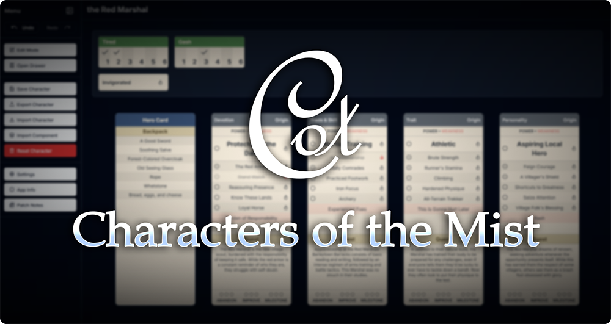

**Characters of the Mist** is a modern, privacy-first, and completely client-side character sheet manager built for TTRPGs like *City of Mist*, *Otherscape*, and *Legends in the Mist*.  It's designed from the ground up to be fast, intuitive, and powerful, giving you full control over your character data without ever needing a server.  All your data is saved directly in your browser's local storage. 

This tool is a complete rewrite of a previous alpha version, focusing on a robust, scalable architecture to make future updates and new game systems easier to implement. 

---
## ✨ Key Features

This application is more than just a character sheet; it's a full-fledged character management system packed with features to make your gameplay experience a breeze.

* **Fully Dynamic Character Sheet:** No more fixed layouts. Add as many Theme Cards, trackers, and components as your character needs. The sheet adapts to you. 
* **Powerful File System Drawer:** A versatile **Drawer** acts as a complete file system for all your character components.  It features full drag-and-drop organization, folder creation, and two different view modes for managing your items. 
* **Intuitive Drag-and-Drop:** Almost everything is draggable. Reorder your cards and trackers on the sheet, move items between folders in the Drawer, or even load an entire character by dragging their sheet from the Drawer onto the main play area. 
* **Robust State Management:** With a state-of-the-art Undo/Redo system (`Ctrl+Z` / `Ctrl+Y`), you can easily fix mistakes whether they happen on the character sheet or in the Drawer. 
* **Command Palette:** For the power users out there, press `Ctrl+K` to summon the **Command Palette**.  Find and execute any action in the app without ever touching your mouse. 
* **Full Localization & Theming:** The app is available in multiple languages and features multiple color themes assorted to the Mist TTRPGs, along with a light/dark mode toggle. 
* **Progressive Web App (PWA):** Install the app directly to your desktop or mobile device for a native-like experience and offline access. 
* **Legacy Data Migration:** A built-in tool helps you seamlessly migrate character sheets from the old alpha version of the app to the new format. 

---
## 🛠️ Tech Stack

This project is built with a modern, robust, and scalable tech stack to ensure a high-quality development and user experience. 

* **Framework:** [Next.js](https://nextjs.org/) (App Router) 
* **Language:** [TypeScript](https://www.typescriptlang.org/) 
* **Styling:** [Tailwind CSS](https://tailwindcss.com/) 
* **UI Components:** [Shadcn/UI](https://ui.shadcn.com/) for accessible component primitives. 
* **State Management:** [Zustand](https://zustand-demo.pmnd.rs/) with `persist` and `temporal` middleware for state persistence and undo/redo functionality. 
* **Drag & Drop:** [dnd-kit](https://dndkit.com/) for a lightweight and powerful drag-and-drop experience. 
* **Command Palette:** [cmdk](https://cmdk.paco.me/) 
* **Localization:** [next-intl](https://next-intl-docs.vercel.app/) 
* **PWA:** [next-pwa](https://www.npmjs.com/package/next-pwa) 

---
## 📜 License

This is a fan-made project and is in no way endorsed by Amit Moshe or Son of Oak Game Studio LLC.

The code for this application is distributed under the **[Creative Commons Attribution-NonCommercial-ShareAlike 4.0 International License (CC BY-NC-SA 4.0)](http://creativecommons.org/licenses/by-nc-sa/4.0/)**.

This means you are free to copy, redistribute, remix, transform, and build upon the material. However, you must give appropriate credit, not use the code for commercial purposes, and distribute your contributions under the same license.